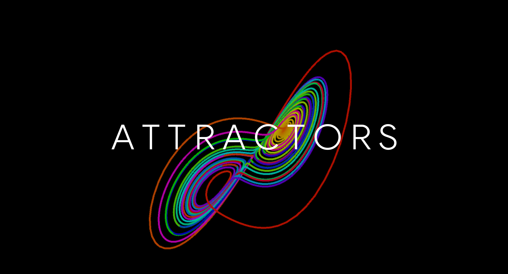
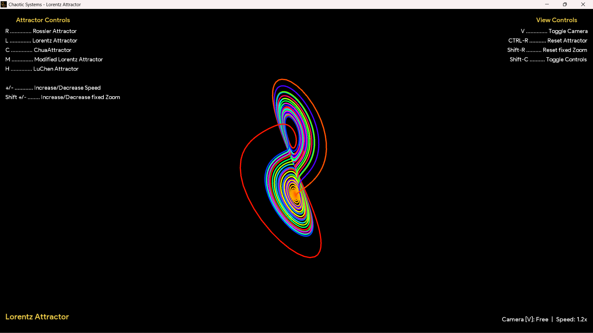
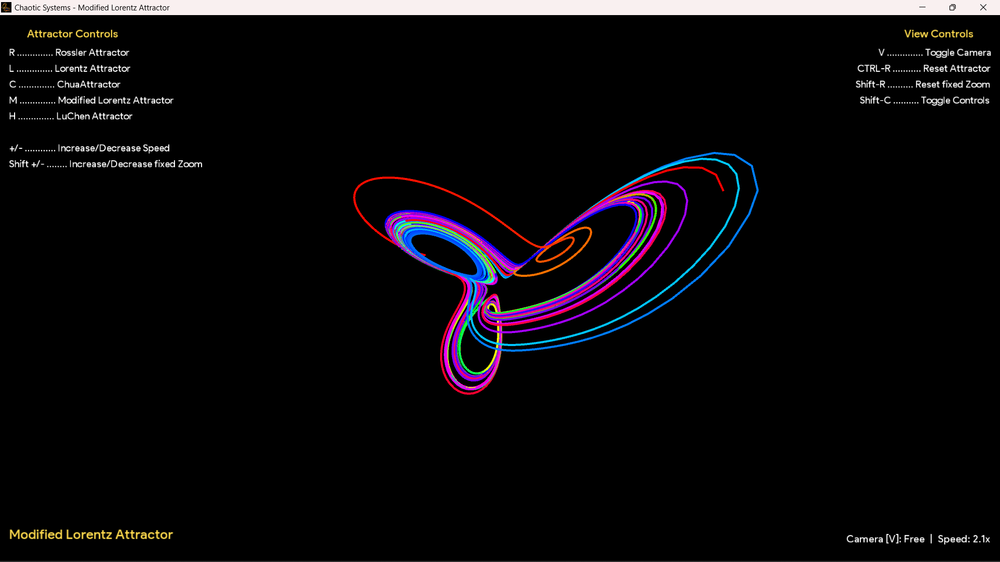
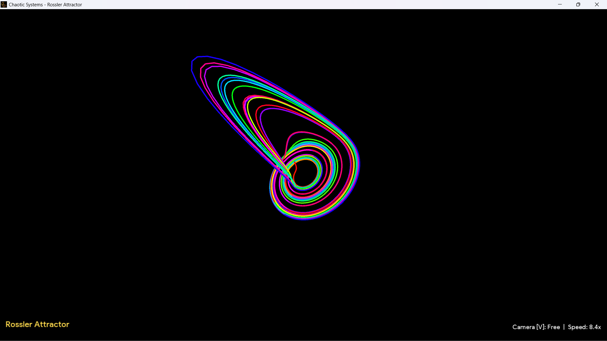
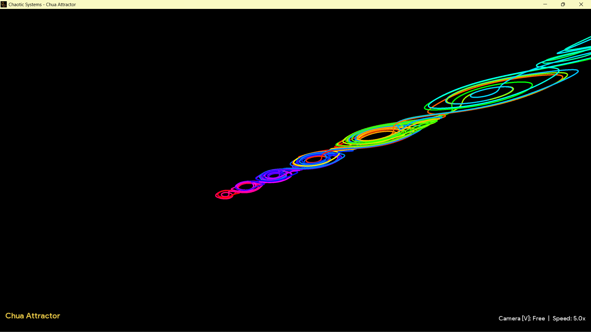
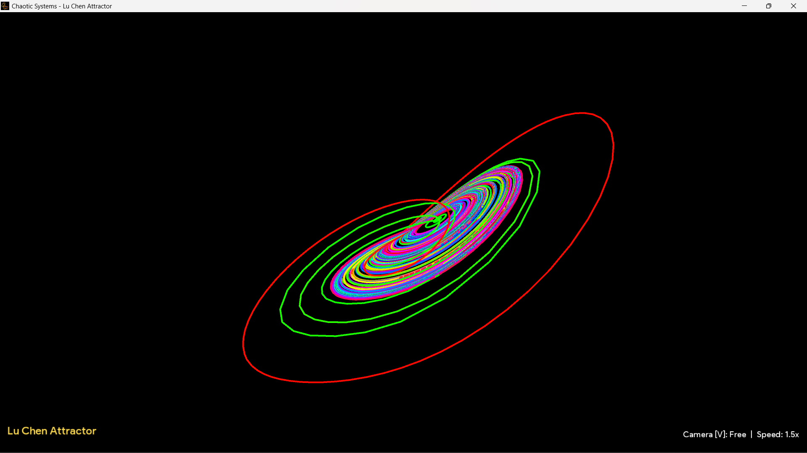

# Chaotic Attractors
#### This a 3D Simulation of mathematical chaotic Attractor systems in processing java
#### [View Demo on YouTube](https://youtu.be/sQUEDPN82Co)
###### See also
[Fourier Series Simulation](https://github.com/ChauhanRohan-RC/Fourier-Series.git)  
[RSA Encryptor](https://github.com/ChauhanRohan-RC/RSA-Encryptor.git)  
[3D Rubik's Cube Solver-AI](https://github.com/ChauhanRohan-RC/Cube.git)

## Introduction
* Attractors are mathematical chaotic systems governed by parametric partial differential equations which evolve through time (or a independent variable) depending on the initial state. 
* An attractor is a dynamic systems, state of which at any point is completely deterministic, but is greatly affected by even tiny changes in initial conditions. 
* Thus, attractors are chaotic (a system which appears random but is fully deterministic)

## Overview
* Inbuilt Attractors
  * Lorentz Attractor
  * Modified Lorentz Attractor
  * Rossler Attractor
  * ChuaAttractor
  * LuChen Attractor

* Interface to code custom attractors
* 3D free camera controls through mouse motion
* configuration like speed, reset, change functions

## Usage
* Install [Java](https://www.oracle.com/in/java/technologies/downloads/) on your computer and add it to the path
* Clone this repository  
  `git clone https://github.com/ChauhanRohan-RC/Attractors.git`
* Navigate to `out\artifacts\Attractors_jar` and run `launch.bat`.  
  Optionally, open the terminal and run `java -jar Attractors.jar`

## Create Custom Attractors
* Create a java class and implement `AttractorI` interface
* Define the initial state as a 3D `Vector` and return it from `getStart()` method
* Implement `calculateNextPoint(Vector prevPoint, float dt)` to define the core evolution logic. Use the time step parameter to evolve the system.
* Optionally, implement the `drawConfig()` method to return a `DrawConfig` object, which controls the drawing of the attractor

## Attractor Controls (key -> Function)

* `R` : Rossler Attractor
* `L` : Lorentz Attractor
* `C` : ChuaAttractor
* `M` : Modified Lorentz Attractor
* `H` : LuChen Attractor

## Controls

* `Mouse Motion`: Translate, Zoom, Scale and Transform
* `V`: Toggle Camera between FREE and FIXED modes
* `+/-`: Increase/Decrease Speed
* `Shift +/-`: Increase/Decrease fixed zoom
* `CTRL-R`: Reset Attractor to initial state
* `Shift-R`: Reset transforms

## Connect on
[Twitter](https://twitter.com/0rc_studio)  
[Youtube](https://www.youtube.com/channel/UCmyvutGWtyBRva_jrZfyORA)  
[Google Play Store](https://play.google.com/store/apps/dev?id=7315303590538030232)  
E-mail: com.production.rc@gmail.com